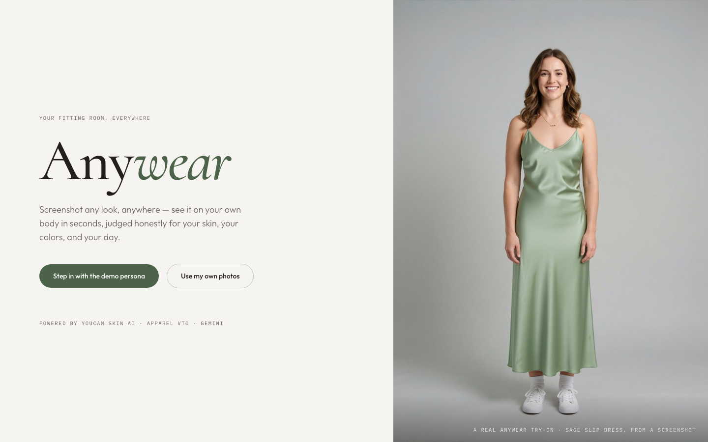
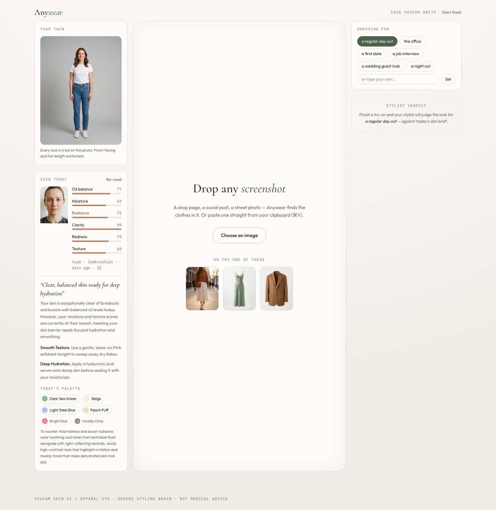
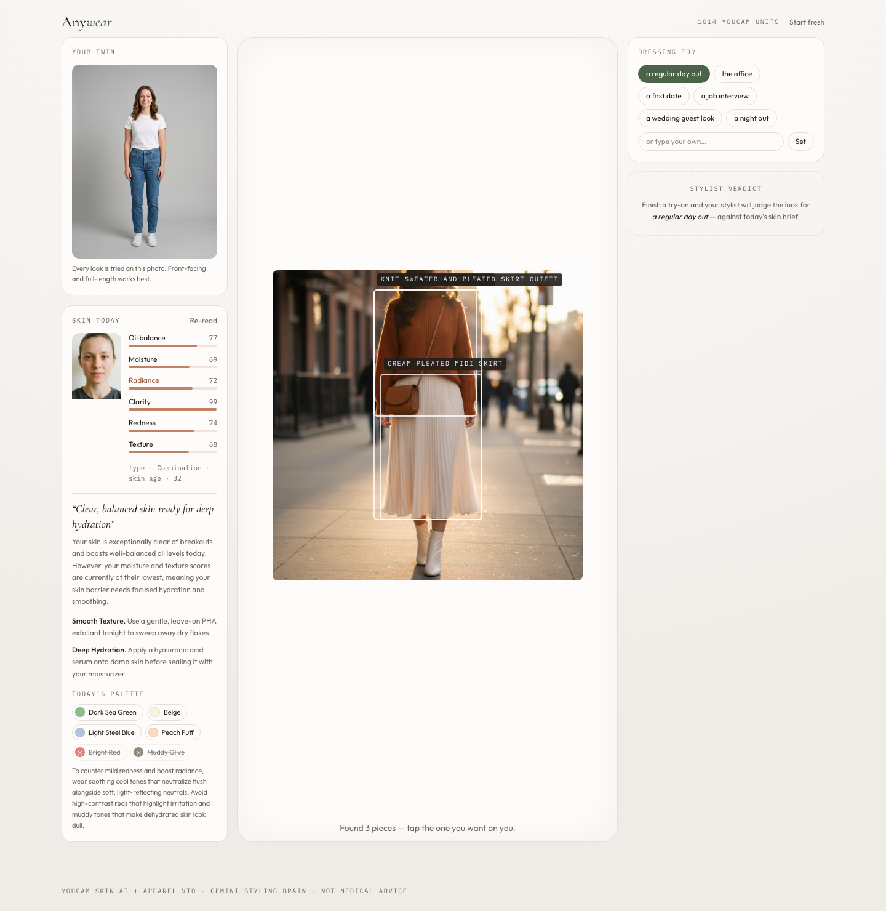
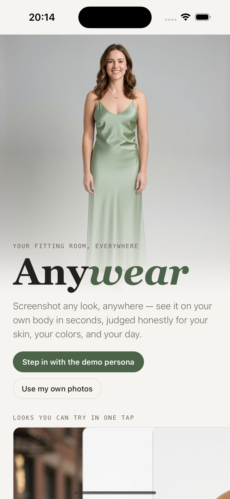
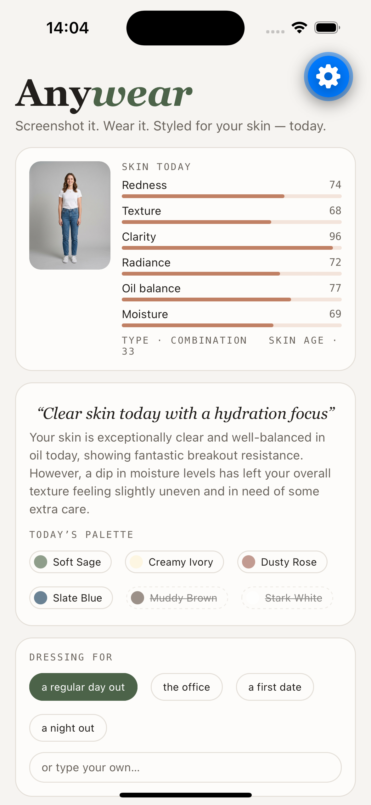
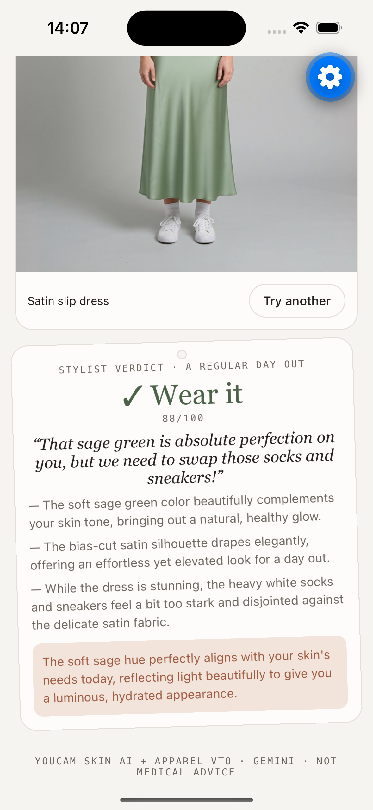

# Anywear

**Screenshot any look, anywhere — see it on your own body in seconds, judged honestly for your skin, your colors, and your day.**

Built for the [YouCam API Skin AI & Apparel VTO Hackathon](https://youcam-api.devpost.com) (combined *Skin AI + Apparel VTO* topic).



## The problem

Fashion inspiration lives in screenshots — a shop page, a social post, a street photo — but none of it answers the two questions that actually decide a purchase: **"how does this look on *me*?"** and **"does it work for me *today*?"** How a garment reads on you is inseparable from how your skin looks the morning you wear it. Apps treat skin and clothing as different industries; your mirror doesn't.

## What Anywear does

1. **Your twin.** One full-body photo becomes your fitting-room double. One bare-faced selfie becomes your skin baseline.
2. **Skin today.** YouCam **AI Skin Analysis** scores seven concerns (redness, oil, moisture, radiance, clarity, texture, skin type + skin age) with per-concern detection masks you can view on your own face. Gemini turns the raw scores into a *daily skin brief*: what stands out, one concrete care action per concern, and — the key move — a **wearable color palette for today** ("visible redness → skip saturated reds near the face, favor cool sages").
3. **Try anything you see.** Drop or paste *any* screenshot. Gemini Vision finds every wearable garment in it — through e-commerce UI chrome, prices, multiple products, worn outfits — classifies each as upper/lower/full-body, and crops a clean reference image. One tap sends it to YouCam **AI Clothes Virtual Try-On (v4)**, and the result appears in a before/after mirror.
4. **The stylist verdict.** Gemini *looks at the actual generated try-on*, cross-references today's skin brief and your chosen occasion, and hands down an honest verdict on a garment hang-tag: Wear it / Maybe / Skip, with grounded reasons, a skin-harmony note, and pairing suggestions.
5. **Lookbook.** Every judged look is kept on-device for side-by-side deciding.

The loop is agentic end-to-end: **measure (Skin AI) → reason (Gemini) → generate (Apparel VTO) → critique (Gemini judge) → decide (you)**.

| Skin today + daily brief | Garment detection on any screenshot | Verdict on the finished try-on |
|---|---|---|
|  |  |  |

## YouCam APIs used

| API | Endpoint | Role |
|---|---|---|
| Auth | `POST /s2s/v1.0/client/auth` | RSA-encrypted `id_token` → bearer access token (cached server-side) |
| File API | `POST /s2s/v2.0/file` + presigned PUT | Uploads the twin photo, selfies, and garment crops |
| **AI Skin Analysis** | `POST /s2s/v2.0/task/skin-analysis` | 7 SD concerns + skin type, `enable_mask_overlay` for per-concern masks, JSON output (`raw_score`/`ui_score`/`skin_age`) |
| **AI Clothes VTO v4** | `POST /s2s/v2.0/task/cloth-v4` | Person `src_file_id` + garment `ref_file_id` + `garment_category` from Gemini's classification |
| Credits | `GET /s2s/v1.0/client/credit` | Live unit balance in the header |

Real unit costs measured in development: **12 units** per skin analysis, **2 units** per try-on.

Gemini (`gemini-3.5-flash` via Vertex AI) provides the three reasoning stages: garment detection with `box_2d` bounding boxes, the skin brief, and the stylist verdict — all with strict JSON schemas.

## Architecture

```text
React 19 + Vite + Tailwind v4 (SPA)
  ├─ zustand store (persisted on-device: photos, skin, lookbook)
  ├─ canvas pipeline: downscale uploads, crop garments from box_2d, upscale small crops
  └─ /api/* → Hono server (Node)
        ├─ youcam.ts  — auth + file upload + skin-analysis + cloth-v4 + credits
        ├─ gemini.ts  — detectGarments / skinBrief / stylistVerdict (JSON-schema outputs)
        └─ image proxy for result URLs (S3 presigned, 2 h expiry)
```

Keys never reach the browser; all YouCam and Gemini calls are server-side.

## Run it

Prereqs: Node 20+, a YouCam API key + secret (RSA public key) from the [API console](https://yce.perfectcorp.com/api-console), and either a `GEMINI_API_KEY` **or** Google Cloud ADC (`gcloud auth application-default login`) with a `GOOGLE_CLOUD_PROJECT`.

```bash
npm install
cp .env.example .env   # fill in keys
npm run dev            # server :8931 + web :5173
```

Open http://localhost:5173, click **"Step in with the demo persona"**, and you are in the fitting room. Production build: `npm run build && npm start`.

## Expo mobile app

`mobile/` contains a React Native (Expo SDK 54) version of the same product — twin + selfie setup, skin scores and daily brief, screenshot try-on with tappable garment detection boxes, hold-to-compare mirror, and the stylist verdict — talking to the same server.

| Home | Skin today + brief | Try-on + verdict |
|---|---|---|
|  |  |  |

Waiting states are crafted, not spinners: a face-scan animation while Skin Analysis runs, a viewfinder sweep during garment detection, and a stitched-hanger "tailoring" card while the try-on generates — each with rotating captions tied to the actual work.

```bash
cd mobile && npm install
EXPO_PUBLIC_API_BASE_URL=http://<your-lan-ip>:8931 npx expo start
```

Scan the QR with Expo Go (on the iOS simulator, `http://localhost:8931` works as-is). `EXPO_PUBLIC_AUTODEMO=1` makes the app walk the whole demo unattended — handy for screenshots and CI.

## Demo assets

All demo people and garments in `public/samples/` are AI-generated (Gemini image models) specifically for this project — no third-party photography, trademarks, or copyrighted material.

## Honest limitations

- Skin analysis is styling guidance, not medical advice, and the UI says so.
- VTO is a visual preview, not a fit/size simulator.
- Result URLs expire (2 h upstream); the lookbook stores downscaled copies on-device instead.

## License

MIT
